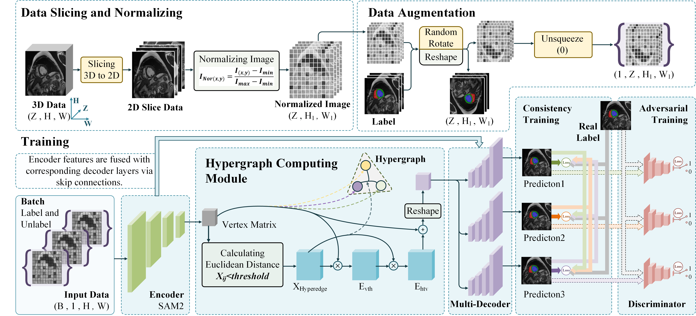

# MFHS
>  *This is the repository for MFHS : Mutual Consistency Learning-based foundation model integrates Hypergraph Computation for Semi-supervised Medical Image Segmentation.* 


> **Abstract:** *In this paper, we propose MFHS, a novel semi-supervised framework that synergizes a vision foundation model with hypergraph learning to address these challenges.Our framework leverages a pre-trained SAM2 encoder to extract robust hierarchical features, which are then refined by a hypergraph neural network that explicitly models many-to-many high-order relationships among anatomical structures.
For semi-supervised training, we employ a multi-decoder architecture to generate high-quality pseudo-labels through a cross-consistency mechanism, further enhanced by an adversarial learning module.*
## Contents
- [Requirements](#requirements)
- [Installation](#install-section)
- [Get Started](#get_started)
- [Training](#training)
- [Testing](#testing)
- [Acknowledge](#acknowledge)
- [Citations](#citations)
- [Contact](#contact)

## Requirements
Tested on **Ubuntu** and Models were trained on a **Nvidia RTX 3090**.

<a id="install-section"></a>
## 🛠️ Installation
- Creat a environment  `conda create -n MFHS`  and activate it  `conda activate MFHS`
  ```shell
  conda create -n MFHS
  ```
  ```shell
  conda activate MFHS
  ```
- `git clone https://github.com/Zhai-Mao/MFHS`
  ```shell
  git clone https://github.com/Zhai-Mao/MFHS
  ```
- Enter the MFHS folder `cd MFHS` and run  `pip install -e.`
  ```shell
  cd MFHS
  ```
  ```shell
  pip install -e.
  ```
- Then install the packages `pip install -r requiremnts.txt`
  ```shell
  pip install -r requiremnts.txt
  ```

<a id="get_started"></a>
## 👉 Get Started
First Download the dataset [ACDC](https://github.com/HiLab-git/SSL4MIS/tree/master/data/ACDC) from **SSL4MS**.  Here, we need to place the list file of ACDC in the specified folder.  
```shell
├── MFHS/
    ├── ACDC/
       ├── data/
       │   ├── slices/
       │   │   ├── train_slices.list
       │   │   ├── val.list
       │   │   ├── patient001_frame01_slice_1.h5
       │   │   ├── patient001_frame01_slice_2.h5
       │   │   └── ...
       │   ├── test.list
       │   ├── patient001_frame01.h5
       │   ├── patient001_frame02.h5
       └── ...
```
Then download the **SAM2 pre-trained checkpoints** named [sam2_hiera_large](https://github.com/facebookresearch/sam2?tab=readme-ov-file) to obtain the corresponding checkpoint files.  
```shell
├── MFHS/
    ├── sam2_hiera_large.pt
    ├── sam2_hiera_small.pt
    └── sam2_hiera_tiny.pt
```

<a id="training"></a>
## ✅ Training  
**Training** a model based on **sam2 large**.
```shell
python train2d_L.py --model="SAM2UNetL" --hiera_path="sam2_hiera_large.pt" --labeled_num=3
```
**Training** a model based on **sam2 small**.
```shell
python train2d_L.py --model="SAM2UNetS" --hiera_path="sam2_hiera_small.pt" --labeled_num=3
```
**Training** a model based on **sam2 tiny**.
```shell
python train2d_L.py --model="SAM2UNetT" --hiera_path="sam2_hiera_tiny.pt" --labeled_num=3
```

<a id="testing"></a>
## 🎬 Testing  
**Testing** a model based on **sam2 large**.
```shell
python test.py --model="SAM2UNetL" --labeled_num=3
```
**Testing** a model based on **sam2 small**.
```shell
python test.py --model="SAM2UNetS" --labeled_num=3
```
**Testing** a model based on **sam2 tiny**.
```shell
python test.py --model="SAM2UNetT" --labeled_num=3
```
<a id="acknowledge"></a>
## 🤝 Acknowledgement
We are very grateful to the contributors of the following open-source projects and other referenced content.
- [SAM2-UNet](https://github.com/WZH0120/SAM2-UNet)
- [SSL4MIS](https://github.com/HiLab-git/SSL4MIS/tree/master)
- [HyperYolo](https://github.com/iMoonLab/Hyper-YOLO)
- [MCNet](https://github.com/ycwu1997/MC-Net)
- [ultralytics](https://github.com/ultralytics/ultralytics/tree/main)

## Citations
```shell
@article{LIU2025112721,
title = {MFHS: Mutual Consistency Learning-Based Foundation Model Integrates Hypergraph for Semi-Supervised Medical Image Segmentation},
journal = {Pattern Recognition},
pages = {112721},
year = {2025},
issn = {0031-3203},
doi = {https://doi.org/10.1016/j.patcog.2025.112721},
url = {https://www.sciencedirect.com/science/article/pii/S0031320325013846},
author = {Xuejun Liu and Zhaichao Tang and Yonghao Wu and Ruixiang Zhai and Xuanhe Dong and Zikang Du and Shujun Cao},
keywords = {Medical Image Segmentation, Semi-Supervised Learning, Vision Foundation Models, Hypergraph Learning, Pseudo-Labeling, Adversarial Learning}
}
```

## 📫Contact
```shell
17370487061@163.com
```
