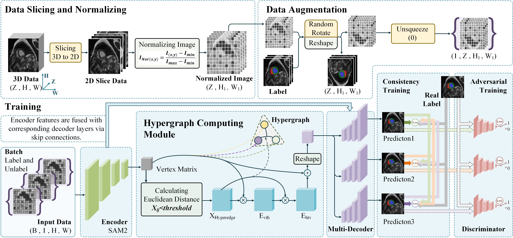

# MFHS
>  *This is the repository for MFHS : Mutual Consistency Learning-based foundation model integrates Hypergraph Computation for Semi-supervised Medical Image Segmentation.* 


> **Abstract:** *In this paper, we propose MFHS, a novel semi-supervised framework that synergizes a vision foundation model with hypergraph learning to address these challenges.Our framework leverages a pre-trained SAM2 encoder to extract robust hierarchical features, which are then refined by a hypergraph neural network that explicitly models many-to-many high-order relationships among anatomical structures.
For semi-supervised training, we employ a multi-decoder architecture to generate high-quality pseudo-labels through a cross-consistency mechanism, further enhanced by an adversarial learning module.*
## Contents
- [Requirements](#requirements)
- [Installation](#install-section)
- [Get Started](#get_started)
- [Training](#training)
- [Testing](#testing)
- [Acknowledge](#acknowledge)

## Requirements
Tested on **Ubuntu** and Models were trained on a **Nvidia RTX 3090**.

<a id="install-section"></a>
## 🛠️ Installation
- Creat a environment  `conda create -n MFHS`  and activate it  `conda activate MFHS`
  ```shell
  conda create -n MFHS
  ```
  ```shell
  conda activate MFHS
  ```
- `git clone https://github.com/Zhai-Mao/MFHS`
  ```shell
  git clone https://github.com/Zhai-Mao/MFHS
  ```
- Enter the MFHS folder `cd MFHS` and run  `pip install -e.`
  ```shell
  cd MFHS
  ```
  ```shell
  pip install -e.
  ```
- Then install the packages `pip install -r requiremnts.txt`
  ```shell
  pip install -r requiremnts.txt
  ```

<a id="get_started"></a>
## 👉 Get Started
First Download the dataset [ACDC](https://github.com/HiLab-git/SSL4MIS/tree/master/data/ACDC) from **SSL4MS**.  Here, we need to place the list file of ACDC in the specified folder.  
```shell
├── MFHS/
    ├── ACDC/
       ├── data/
       │   ├── slices/
       │   │   ├── train_slices.list
       │   │   ├── val.list
       │   │   ├── patient001_frame01_slice_1.h5
       │   │   ├── patient001_frame01_slice_2.h5
       │   │   └── ...
       │   ├── test.list
       │   ├── patient001_frame01.h5
       │   ├── patient001_frame02.h5
       └── ...
```
Then download the **SAM2 pre-trained checkpoints** named [sam2_hiera_large](https://github.com/facebookresearch/sam2?tab=readme-ov-file) to obtain the corresponding checkpoint files.  
```shell
├── MFHS/
    ├── sam2_hiera_large.pt
    ├── sam2_hiera_small.pt
    └── sam2_hiera_tiny.pt
```

<a id="training"></a>
## ✅ Training  
```shell
python train.py
```

<a id="testing"></a>
## 🎬 Testing  
```shell
python test.py
```
<a id="acknowledge"></a>
## 🤝 Acknowledgement
We are very grateful to the contributors of the following open-source projects and other referenced content.
- [SAM2-UNet](https://github.com/WZH0120/SAM2-UNet)
- [SSL4MIS](https://github.com/HiLab-git/SSL4MIS/tree/master)
- [HyperYolo](https://github.com/iMoonLab/Hyper-YOLO)
- [MCNet](https://github.com/ycwu1997/MC-Net)

